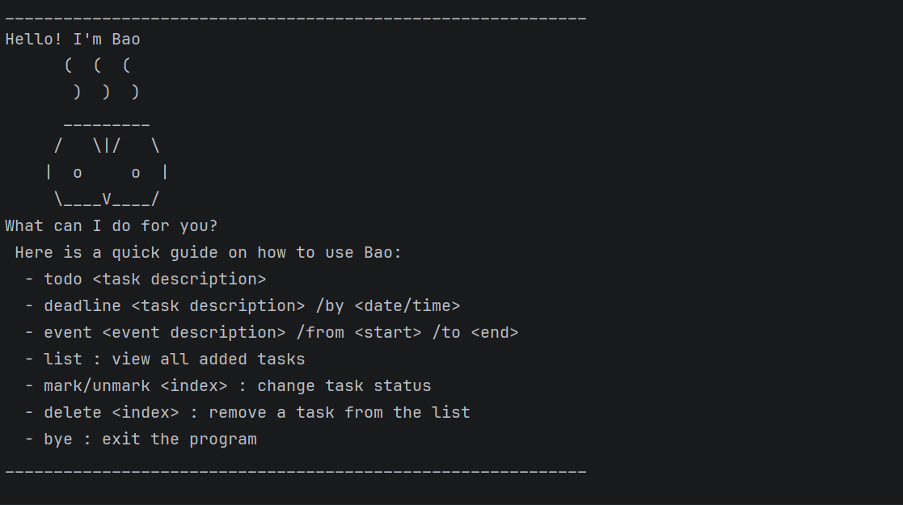

# Bao User Guide



Bao is s a CLI-based (Command Line Interface) task management application designed to help you keep track of your daily responsibilities with ease. Whether it’s a simple "todo" or a deadline-driven project, Bao has your back.

## Features

### Notes about the command format:

- Words in `UPPER_CASE` are the parameters to be supplied by the user.
  
- Extraneous parameters for commands that do not take in parameters (such as `list` and `bye`) will be ignored.

### Adding deadlines

Adds a task to the list that must be completed by a specific date or time. This is perfect for tracking assignments or project milestones that have due dates.

Format: `deadline DESCRIPTION /by DATE/TIME`

- The description and the time following /by cannot be empty.

Example: `deadline Return library book /by Sunday 5pm`

Expected Output:

```
 Got it. I've added this task:
   [D][ ] Return library book (by: Sunday 5pm)
 Now you have 1 tasks in the list.
```

### Adding to-do(s)

Adds a task to the list. 

Format: `todo DESCRIPTION`

- The description cannot be empty.
Example: `todo Go for a run`

Expected Output:

```
 Got it. I've added this task:
   [T][ ] Go for a run
 Now you have 2 tasks in the list.
```


### Adding events

Adds a task to the list that has a specific start and end duration.

Format: `event DESCRIPTION /from START_DATE/TIME \to END_DATE/TIME`

- The description, start time and end time cannot be empty.

Example: `event Project meeting /from Mon 2pm /to 4pm`

Expected Output:

```
 Got it. I've added this task:
   [E][ ] Project meeting (from: Mon 2pm to: 4pm)
 Now you have 3 tasks in the list.
```


### Listing all tasks

Shows all tasks currently stored in your list, along with their status icons and types.

Format: `list`

Example: `list`

Expected Output:

```
 Here are the tasks in your list:
 1. [T][ ] Go for a run
 2. [D][ ] Return library book (by: Sunday 5pm)
 3. [E][ ] Project meeting (from: Mon 2pm to: 4pm)
```

### Marking a task as done

Marks a specific task in the list as completed.

Format: `mark INDEX`

- `INDEX`refers to the task number shown in the displayed task list.
- The index must be a positive integer and be a valid task number in the list

Example: `mark 1`

Expected Output:

```
 Nice! I've marked this task as done: 
 [T][X] Go for a run
```

### Unmarking a task as not done

Unmarks a specific task in the list as not completed.

Format: `unmark INDEX`

- `INDEX`refers to the task number shown in the displayed task list.
- The index must be a positive integer and be a valid task number in the list

Example: `unmark 1`

Expected Output:

```
 OK, I've marked this task as not done yet: 
 [T][ ] Go for a run
```


### Deleting a task

Removes a specific task in the list.

Format: `delete INDEX`

- `INDEX`refers to the task number shown in the displayed task list.
- The index must be a positive integer and be a valid task number in the list

Example: `delete 1`

Expected Output:

```
 Noted. I've removed this task:
   [T][ ] Go for a run
 Now you have 2 tasks in the list.
```

### Finding a task by keyword

Searches for tasks in the list whose descriptions contain the specified keyword.

Format: `find KEYWORD`

- `KEYWORD` is case-insensitive

Example: `find book`

Expected Output:

```
 Hopefully I have found what you are looking for:
 1. [D][ ] Return library book (by: Sunday 5pm)
```

### Exiting the program

Closes the Bao application. Your tasks are automatically saved to the data file before exiting.

Format: `bye`

Example: `bye`

Expected Output:

```
Bye. Hope to see you again soon!
____________________________________________________________
```

### Using Local Data File

The Bao application utilies a .txt file to manage inter-sessions data persistence. Bao data are saved in the hard disk automatically after any command that changes the data. There is no need to save manually.


- Save Location: Tasks are saved in `./data/bao.txt.`
- Automatic Loading: Every time you start the app, Bao will look for this file to restore your list.
  - Expected output of a successful load:
  ```
  file with path: data/bao.txt loaded successfully :)
  ```


